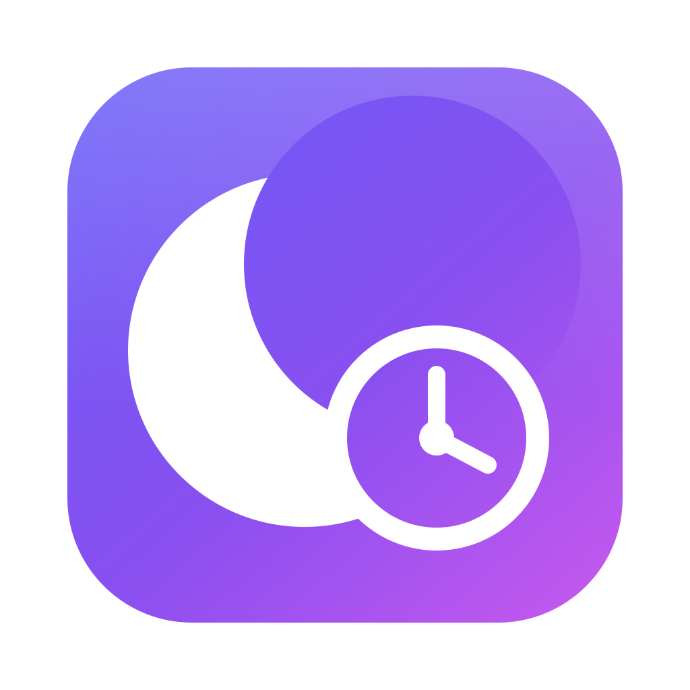
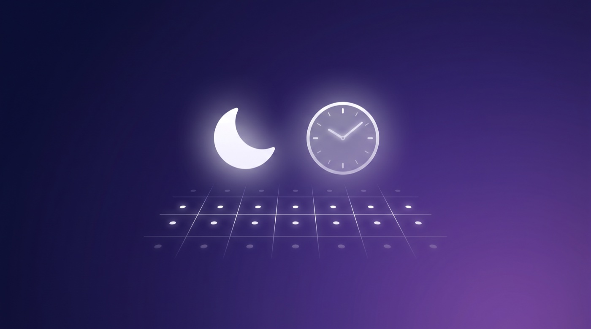

<p align="center">
  
</p>

<h1 align="center">
   RosterFocus
</h1>

<p align="center"><strong>Turn iOS/macOS Focus modes on and off automatically from your shift calendar — no fixed schedule required.</strong></p>

<p align="center">
  <a href="https://github.com/TemujinCalidius/roster-focus/releases/latest"></a>
  <a href="https://github.com/TemujinCalidius/roster-focus/actions/workflows/ci.yml"></a>
  
  <a href="LICENSE"></a>
  <a href="https://github.com/sponsors/TemujinCalidius"></a>
</p>

<p align="center">
  <a href="https://temujincalidius.github.io/roster-focus/"><b>🌐 Website</b></a> ·
  <a href="https://github.com/TemujinCalidius/roster-focus/releases/latest/download/RosterFocus.dmg"><b>⬇️ Download</b></a> ·
  <a href="SETUP.md"><b>Setup guide</b></a> ·
  <a href="https://github.com/TemujinCalidius/roster-focus/discussions"><b>Discussions</b></a>
</p>

---

If you work **shifts that move around** — different days, different hours, different locations —
Apple's time- and location-based Focus automations don't fit. RosterFocus instead reads your
**shift events from a calendar** and turns the right **Focus** on while you're on shift, then off
when it ends. Because it keys off calendar *events* (not clock times), it works no matter how
irregular your roster is, and the Focus follows you to your iPhone.

## ⬇️ Get the app

1. **[Download `RosterFocus.dmg`](https://github.com/TemujinCalidius/roster-focus/releases/latest/download/RosterFocus.dmg)** (the macOS installer).
2. Open the DMG and **drag RosterFocus to Applications**.
3. Launch it — a 🌙 icon appears in your menu bar. Open **“Set Up / Edit Rules…”** and follow the wizard.

It's **Developer ID-signed and notarized by Apple**, so it opens with no Gatekeeper warning.
Prefer the command line / running on a headless Mac? See [the CLI](#-headless--power-users-the-cli).

## How it works

<p align="center">
  
</p>

```
your shift calendar ──▶ RosterFocus (on your Mac) ──▶ decides which Focus ──▶ runs your Shortcut
                                                                                      │
                                            Focus syncs to your iPhone via “Share Across Devices”
```

Apple gives apps **no way to create a Focus or to turn one on/off** — only the **Shortcuts** app
can flip a Focus. So RosterFocus does the part it *can* automate — watching your calendar and
deciding which Focus should be active right now — and runs a Shortcut you set up to do the actual
toggle. The Focus then propagates to your iPhone through *Settings → Focus → Share Across Devices*.

## ✨ Features

- **Shift-aware.** Triggers on calendar *events* — variable days, hours, overnight/multi-day shifts.
- **Multiple Focus modes.** Map several calendars (and optional title keywords) to different
  Focuses — e.g. `On-Call → Do Not Disturb`, `Work → Work`, `Gym → Fitness`.
- **Priority ordering.** iOS allows one Focus at a time; the first matching rule wins.
- **Lead / trail padding.** Start a Focus a few minutes before a shift, or hold it after.
- **Respects manual overrides.** Acts only on a *change*, so killing a Focus mid-shift sticks.
- **Two ways to run it** — a friendly **menu-bar app** or a headless **CLI**, sharing one config.

## 🚀 Set it up (about 5 minutes, one time)

The app's wizard walks you through these; here's the whole picture.

> **One-time, only you can do these** — macOS has no API for them:

| Step | What | Where |
|---|---|---|
| **1. Calendar access** | Let RosterFocus read your calendar | Wizard → *Grant Calendar Access* (a system prompt appears) |
| **2. Create a Focus** | A Focus named e.g. **Work** (Apple's built-in “Work” is ideal) | System Settings → Focus → **+** (the wizard opens this for you) |
| **3. Add the Shortcuts** | A *Work Focus On* / *Work Focus Off* pair | Wizard → *Import* the ready-made pair, or build your own |
| **4. Add a rule** | Map your shift calendar → that Focus | Wizard → Rules (pick from dropdowns) |
| **5. Share to iPhone** | **Settings → Focus → Share Across Devices = ON** | On *both* your Mac and iPhone |

Then enable it (and *Launch at login*) and close the window — RosterFocus keeps running in the
menu bar. Add more Focuses anytime: create the Focus, make its Shortcut pair, add a rule.
Full details, including the exact Shortcut actions, are in **[SETUP.md](SETUP.md)**.

### Example: different Focuses from one roster

```jsonc
{
  "rules": [
    { "calendar": "On-Call", "focus": "Do Not Disturb",
      "on_shortcut": "DND On", "off_shortcut": "DND Off" },
    { "calendar": "Work", "keyword": "night", "focus": "Sleep",
      "on_shortcut": "Sleep Focus On", "off_shortcut": "Sleep Focus Off" },
    { "calendar": "Work", "focus": "Work",
      "on_shortcut": "Work Focus On", "off_shortcut": "Work Focus Off" }
  ]
}
```

> On-call shifts → Do Not Disturb; a Work event titled “night…” → Sleep; any other Work event →
> Work. Rules are evaluated top to bottom. See
> [Adding more Focus modes](SETUP.md#adding-more-focus-modes).

## ⌨️ Headless / power users: the CLI

A Python CLI + `launchd` agent runs the same logic without a GUI — ideal for an **always-on Mac
mini** you never log into graphically.

```bash
git clone https://github.com/TemujinCalidius/roster-focus.git
cd roster-focus && ./install.sh          # venv + bindings, config, launchd agent, guided setup
python3 rosterfocus.py --doctor          # health check: permission, calendars, Shortcuts
```

The app and the CLI share `~/.config/roster-focus/config.json` and make identical decisions —
**don't run both at once** (disable the launchd agent first:
`launchctl unload ~/Library/LaunchAgents/com.rosterfocus.agent.plist`). Diagnostics:
`--doctor`, `--validate`, `--list-calendars`, `--dry-run -v`. Full guide: **[SETUP.md](SETUP.md)**.

## Why can't it just create the Focus / set it directly?

Two deliberate Apple restrictions, and RosterFocus works within both:

1. **No app can create a Focus mode** — there's no public API, Shortcut action, or AppleScript for
   it. You create the Focus once in System Settings.
2. **No app can turn a Focus on/off directly** — only the **Shortcuts** app can, so RosterFocus
   runs a Shortcut. Everything else (deciding *when*, from your calendar) is automated.

## How it differs from similar tools

[calendar-focus-sync](https://github.com/a11rew/calendar-focus-sync) and
[focus-time-app](https://github.com/focus-time/focus-time-app) activate macOS Focus from
meeting/“focus time” calendar blocks. RosterFocus is built around **shift work**, treats the
**iPhone as the target** (via Share Across Devices), and maps multiple calendars to multiple Focuses.

## Building from source

Everything's open. The app is SwiftUI (`app/`, generated from `app/project.yml` via
[XcodeGen](https://github.com/yonyz/XcodeGen)); the CLI is `rosterfocus.py`. See
**[CONTRIBUTING.md](CONTRIBUTING.md)** for build + test commands and the release runbook.

## Contributing

PRs welcome! RosterFocus uses a `dev`/`main` model (code → `dev`, docs → `main`). Questions and
ideas → [Discussions](https://github.com/TemujinCalidius/roster-focus/discussions).
See [CONTRIBUTING.md](CONTRIBUTING.md).

## Security

Found a vulnerability? Please report it privately — see [SECURITY.md](SECURITY.md).

## 💜 Sponsor

RosterFocus is free and MIT-licensed. If it makes your shifts a little calmer, you can
[**sponsor the project**](https://github.com/sponsors/TemujinCalidius) — it funds an Apple
Developer membership (so the app stays signed + notarized) and ongoing work.

## License

[MIT](LICENSE) © 2026 Samuel Lison
